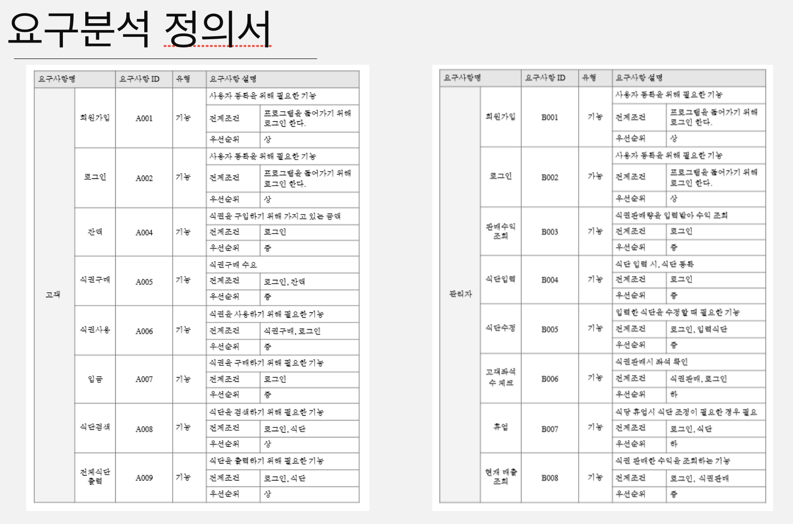
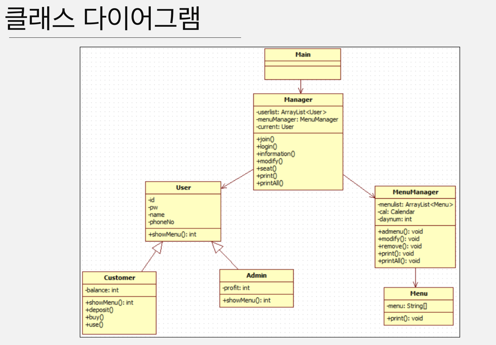

# Menu List_System

프로젝트 주제 선정 중 점심시간이 되었고, 본 건물 지하 ‘밥뜨랑’ 에서 식사하러 가던 중 메뉴에 대한 이야기를 하다가 고안하게 되었습니다.
관리자와 고객 사이에서 식단이라는 정보를 주고 받을 수 있는 시스템을 만들면 좋겠다는 생각을 하였고, 그것을 이번 저희 미니 프로젝트에서 진행하기로 하였습니다.

## 요구분석

## 클래스 구조

